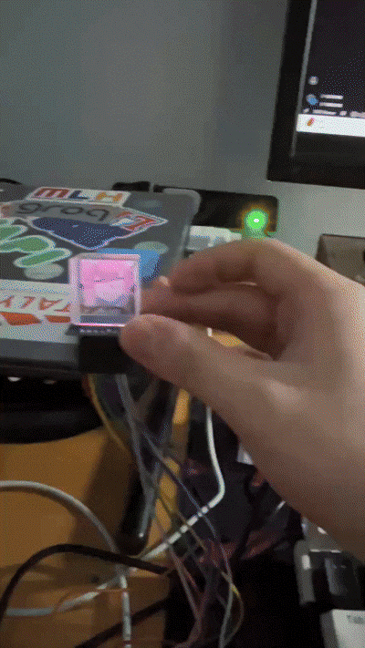

# HoloCube3D

A compact, animated desktop companion powered by the ESP32-S3-WROOM-1 (N16R8). This project uses a high-speed IPS display and a beam-splitting cube to create a pseudo-holographic 3D animation effect.



[View Presentation](https://canva.link/rwkxsu6l7c77ncn)

## Materials Used
- Microcontroller: ESP32-S3-WROOM-1 (N16R8), 16MB Flash, 8MB PSRAM
- Display: 1.3" IPS TFT LCD (240x240)
- Optics: Beam-splitting cube

## Overview
HoloCube3D renders an animation loop by pushing pre-baked frames to the TFT with `TFT_eSPI`. Two display modes are supported, selected at compile time:

- **RGB565 (default):** Full color, 16 bits per pixel. ~70 frames fit in 8 MB flash at 240×240.
- **Binary (1-bit):** Black and white only, 1 bit per pixel. ~1,140 frames fit in the same flash — 16× more video for the same hardware.

## File Structure
- `HoloCube3D.ino`: Main Arduino sketch — initializes the display and plays frames in the selected mode.
- `stream_video.py`: PC-side script for streaming a video file or screen capture over USB Serial (stream mode).
- `ColoredVideoFrame.h`: RGB565 frame data header. Used in color mode. Currently not active.
- `VideoFrame.h`: 1-bit packed frame data header. Used in binary mode. Currently not active.
- `gif-split.py`: GIF-to-RGB565 helper script for generating frame header files.
- `User_Setup.h`: Display/pin configuration for `TFT_eSPI`.

## Header File Formats

The header file format differs depending on which mode is active in `HoloCube3D.ino`.

### Color mode — `ColoredVideoFrame.h`
Frames are stored as `uint16_t` RGB565 values (2 bytes per pixel). Each frame is a separate named array, and a pointer table is used to index them:
```cpp
#define FRAME_COUNT  5
#define FRAME_WIDTH  240
#define FRAME_HEIGHT 240

const uint16_t frame_000[] PROGMEM = { 0xFFFF, 0x0000, ... };
// ...
const uint16_t* const frames[FRAME_COUNT] PROGMEM = { frame_000, ... };
```

### Binary mode — `VideoFrame.h`
Frames are stored as packed 1-bit values (8 pixels per byte, MSB-first). All frames live in a single 2D array — no pointer table needed:
```cpp
const int TOTAL_FRAMES = 247;
const int FRAME_DELAY  = 41;

const unsigned char video_frames[][1024] PROGMEM = {
  { 0xff, 0xff, ... },  // frame 0
  { 0xff, 0xfe, ... },  // frame 1
  // ...
};
```
The inner array size (e.g. `1024`) must equal `ceil(SRC_W * SRC_H / 8)`.

## Display Modes

### Stream Mode — currently active
Live video is sent from your PC to the device over USB Serial as full RGB565 frames. No `.h` file needed.

1. Install [TFT_eSPI](https://github.com/Bodmer/TFT_eSPI) in Arduino IDE.
2. Copy `User_Setup.h` into the TFT_eSPI library folder (see Setup Gotcha below).
3. Confirm `#define STREAM_MODE` is uncommented in `HoloCube3D.ino`.
4. Upload. The display will show "nothing" until the Python script connects.
5. Install Python dependencies:
   ```
   pip install pyserial mss Pillow numpy opencv-python
   ```
6. Run the streaming script:
   ```
   python stream_video.py --port COM4 --video myvideo.mp4
   ```
   Or stream your screen instead:
   ```
   python stream_video.py --port COM4
   ```

**Notes:**
- Baud rate defaults to 4 Mbaud in both sketch and script. Change `Serial.begin(4000000)` and `--baud` together if needed.
- Frames are scaled to fit the display (240×240) with letterboxing — aspect ratio is always preserved.
- To mirror horizontally (required for the holographic beam-splitting cube), uncomment `#define FLIP_V` in the sketch.
- At 2 Mbaud, expect ~1–2 fps at 240×240. Reduce `DISP_W`/`DISP_H` in both the sketch and script for higher frame rates.

### Binary (1-bit) Mode — currently not active
1. Install [TFT_eSPI](https://github.com/Bodmer/TFT_eSPI) in Arduino IDE.
2. Copy `User_Setup.h` into the TFT_eSPI library folder (see Setup Gotcha below).
3. Place `VideoFrame.h` in the sketch folder. Set `SRC_W` and `SRC_H` in the sketch to match your frame dimensions.
4. Confirm `#define BINARY_MODE` is uncommented in `HoloCube3D.ino`.
5. Upload. Each bit is expanded to `0xFFFF` (white) or `0x0000` (black) at runtime.

### RGB565 Color Mode
1. Complete steps 1–2 above.
2. Place `ColoredVideoFrame.h` in the sketch folder (see format above).
3. Comment out `#define BINARY_MODE` in `HoloCube3D.ino`.
4. Upload.

## Setup Gotcha
TFT_eSPI reads its config from `User_Setup.h` inside the **library folder**, not the sketch folder. Copy the repo's `User_Setup.h` into the installed library, or the display will not initialise correctly.

## Notes
- `gif-split.py` currently writes `frame_XXX.h` files. If you prefer a single `ColoredVideoFrame.h`, combine the generated frames into one header with a `uint16_t` pointer array (matching the color mode format above).

## License
Open-source. Replace frame data to display your own hologram animations.
